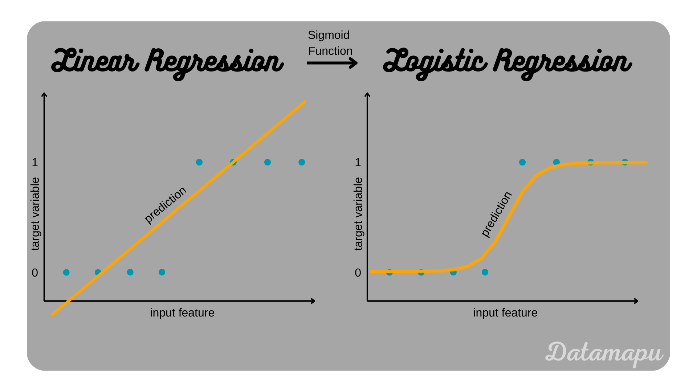
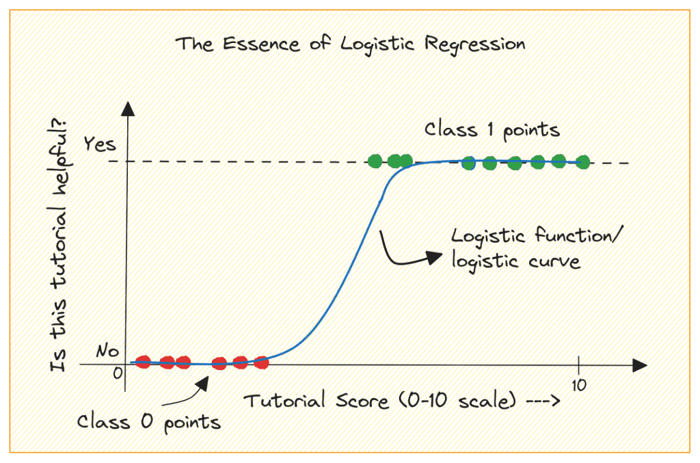

# Linear Regression:

## Purpose:

Used for predicting a continuous dependent variable based on one or more independent variables.

**How it Works:**

Model: Linear regression models the relationship between the dependent variable y and the independent variables X using a linear equation:

## Assumptions:
- Linearity: The relationship between the dependent and independent variables is linear.
- Independence: Observations are independent of each other.
- Homoscedasticity: Constant variance of errors.
- Normality: The errors (residuals) of the model are normally distributed.
- Optimization: The coefficients are estimated using the method of least squares, which minimizes the sum of the squared differences between the observed and predicted values:
 
**Prediction**: The model provides a continuous output (e.g., predicting house prices).

---

# Logistic Regression:

## Purpose:

Used for predicting a binary (or categorical) dependent variable, typically representing classes or outcomes (e.g., success/failure, yes/no).

**How it Works:**

Model: Logistic regression models the probability that a given input point belongs to a particular class. Instead of a linear equation, it uses the logistic function (sigmoid function) to map predicted values to probabilities:

## Assumptions:
- The dependent variable is binary.
- Linearity in the logit: The log odds of the dependent variable are a linear combination of the independent variables.
- Independence of observations.
- Optimization: The coefficients are estimated using the method of maximum likelihood estimation (MLE), which finds the parameters that maximize the likelihood of observing the given data:

This is equivalent to minimizing the binary cross-entropy (log loss).

**Prediction**: The model provides probabilities that a given instance belongs to a particular class. A threshold (e.g., 0.5) is typically applied to classify the output into binary classes 

---

# Key Differences:

## Output:
- Linear Regression: Continuous values.
- Logistic Regression: Probabilities (which can be converted to binary outcomes).

## Equation:
- Linear Regression: Linear equation.
- Logistic Regression: Logistic function applied to a linear equation.

## Use Cases:
- Linear Regression: Predicting quantities (e.g., predicting sales, temperature).
- Logistic Regression: Predicting categories (e.g., spam detection, disease diagnosis).

## Loss Function:
- Linear Regression: Mean squared error (MSE).
- Logistic Regression: Binary cross-entropy (log loss).
